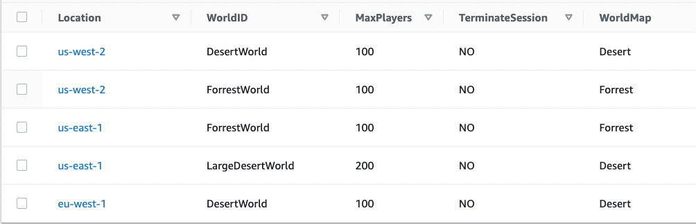

# Hosting Persistent Worlds on AWS

- [Key Features](#key-features)
- [Considerations](#considerations)
- [Contents](#contents)
- [Architecture Diagram](#architecture-diagram)
- [Preliminary Setup for the Backend](#preliminary-setup-for-the-backend)
- [Preliminary Setup for Unity](#preliminary-setup-for-unity)
- [Deployment with AWS CDK](#deployment-with-aws-cdk)
- [Testing with the sample Unity client](#testing-with-the-sample-unity-client)
  * [Running Clients](#running-clients)
- [Implementation Overview](#implementation-overview)
  * [Serverless Backend](#serverless-backend)
    + [World Manager](#world-manager)
    + [Backend APIs](#backend-apis)
  * [GameLift Resources](#gamelift-resources)
  * [Game Server and Game Client](#game-server-and-game-client)
    + [Game Server Refresh](#game-server-refresh)
  * [Local Testing](#local-testing)
- [Resource clean up](#resource-clean-up)
- [License](#license)

This repository contains a solution for hosting persistent world games and virtual worlds on AWS leveraging Amazon GameLift, a fully managed game server hosting solution, with a serverless backend service and management layer. The solution is designed for getting quickly started with persistent virtual world game or application development on MacOS and Windows. It includes infrastructure as code automation, as well as deployment scripts to deploy all the required resources, and includes a sample Unity client and server implementation.

This Readme includes the architecture overview, as well as deployment instructions and documentation for the serverless backend services as well as the GameLift infrastructure.

**Note**: _“The sample code; software libraries; command line tools; proofs of concept; templates; or other related technology (including any of the foregoing that are provided by our personnel) is provided to you as AWS Content under the AWS Customer Agreement, or the relevant written agreement between you and AWS (whichever applies). You should not use this AWS Content in your production accounts, or on production or other critical data. You are responsible for testing, securing, and optimizing the AWS Content, such as sample code, as appropriate for production grade use based on your specific quality control practices and standards. Deploying AWS Content may incur AWS charges for creating or using AWS chargeable resources, such as running Amazon EC2 instances or using Amazon S3 storage.”_

# Key Features
* Uses AWS Cloud Development Kit (AWS CDK) to automate the deployment of all resources
* Uses a Serverless solution for global provisioning and management of the worlds, with world configurations in a DynamoDB NoSQL table
* Uses Serverless APIs for backend functionalities such as listing and joining worlds
* Runs on Amazon Linux 2 on the Amazon GameLift service with a multi-region fleet that can host worlds in any of the supported Regions and Local Zones
* Uses Cognito Identity Pools to store user identities and to authenticate the users against the backend
* Includes configuration to push custom logs and metrics to CloudWatch with CloudWatch Agent
* Provides Unity example implementations for client and server
* Leverages the GameLift Fleet Role to access world data persisted in Amazon DynamoDB

The project is a simple "game" where any number of players (based on your world configuration, up to 200) will join game worlds, move around them, and their location will be persisted in Amazon DynamoDB for future sessions as an example of data persistence. The movement inputs are sent to the server which runs the game simulation on a headless Unity process and syncs state back to all players.

**NOTE**: Even though the sample implementation uses Unity, all of the backend logic can be used with any game server and client implementation. For details on how to integrate GameLift with different game engines, [check out the documentation](https://docs.aws.amazon.com/gamelift/latest/developerguide/gamelift-sdk-server-api.html).

# Considerations

There are a few key things to consider when validating if Amazon GameLift is a good fit for your persistent world needs.

1. **Player sessions**: Amazon GameLift can create up to 200 players sessions within each world. This is enough for a lot of needs, but in some cases you would want to go beyond that. It is completely possible to do, still using GameLift, by replacing the player session management with your own. Instead of creating player sessions for the game session using the GameLift API, you would create these in your own database, such as Amazon DynamoDB.
2. **Database access from game servers**: As shown in this example, it's easy to access Amazon DynamoDB through the AWS API by using the Fleet IAM role. The same applies to any database or storage option that you can access directly with the access credentials of the Fleet instance, such as Amazon S3. If you need to have private connectivity to databases within your own VPC, you would need to have the game server call a AWS Lambda function running in your VPC, which can have access to your databases within private VPC subnets.
3. **Access to database across locations**: The game server processes access a few different DynamoDB tables to persist data and check for the termination flag. This sample solution uses a single location for these tables, which can introduce latency for game servers running in other locations than the home region. DynamoDB allows you to configure [DynamoDB global tables](https://aws.amazon.com/dynamodb/global-tables/), which would enable local access to the database in each region. Global tables are eventually consistent, but as the worlds only write their own data, and read the shared termination configuration, this approach would work.
3. **Partitioned large-scale MMOs**: If you are building an MMO that requires partitioning of the world to allow thousands of players to play together in the same world, GameLift might not be the best fit for your use case. This is better achieved through custom solutions on Amazon EC2, Amazon ECS or Amazon EKS.

# Contents

The project contains:
* **An AWS CDK project** that creates all the resources including the serverless backend and GameLift (`Backend`)
* **A build folder for the server build** which includes a set of pre-required files for configuration and where you will build your Linux server build from Unity (`LinuxServerBuild`)
* **A Unity sample implementation of the game server and client** (`UnityProject`)

# Architecture Diagram

The architecture diagram introduced here describes all of the components of the solution, as well as step by step data flows.

# Preliminary Setup for the Backend

1. **Clone the repository**:
    * `git clone git@github.com:aws-solutions-library-samples/guidance-for-persistent-world-game-hosting-on-aws.git`
    * **Windows only**: Make sure you have the repository within a relatively short path as longer paths can introduce issues with some Powershell commands.
2. **Make sure you have the following tools installed**
    * **Install AWS CDK**
        * Follow these instructions to install the AWS CDK Toolkit: [AWS CDK installation](https://docs.aws.amazon.com/cdk/v2/guide/cli.html). You will need to have [NPM installed](https://nodejs.org/en/download/) to install CDK.
    * **Install Typescript**
        * Run `npm install -g typescript` to install Typescript, which is used by the CDK application. See [Working with CDK In Typescript for more details](https://docs.aws.amazon.com/cdk/v2/guide/work-with-cdk-typescript.html).
3. **Select deployment Region**
    * The default AWS Home Region for the solution is _us-east-1_. You can choose any supported GameLift Home Region to deploy the solution. This region will host the backend and act as the home region of the GameLift fleet, but you can configure worlds to be deployed to any supported location within the multi-region Fleet

# Preliminary Setup for Unity

1. **Install Unity3D 2019, Unity 2020, or Unity 2021**
    * Use the instructions on Unity website for installing: [Unity Hub Installation](https://unity.com/download)
    * Make sure to install the **Linux build support for server builds**, and your **local build support** (MacOS or Windows) for local client builds. In Unity Hub, go to *Installs*, select *Add Modules* from the configuration menu and add both Linux Build Support (Mono), and your local platform (Windows/Mac). For Unity 2021, also add **Linux Dedicated Server support**.
    * **Don't open the Unity project yet** as we still need to download and build dependencies!
2. **Install Build Tools**
    * **MacOS**:
      * Go to [Mono Project Download Page](https://www.mono-project.com/download/stable/) and follow the instructions for installing Mono
      * Restart your terminal if you had it open
      * Mono will come with the build tools needed in the next step
    * **Windows**:
      * [Download Visual Studio 2022 Build Tools](https://aka.ms/vs/17/release/vs_BuildTools.exe), run the installer, **select *".NET Desktop Build Tools"*** and install. This should install 4.7.2 framework by default (needed for the GameLift Server SDK build). Please check it is included (If not, you can add it separately afterward by modifying the installation)
      * **Add the bin path of the MSBuild installation to your PATH in environment variables** (for example *C:\Program Files (x86)\Microsoft Visual Studio\2022\BuildTools\MSBuild\Current\Bin*)
      * [Download nuget](https://dist.nuget.org/win-x86-commandline/latest/nuget.exe) and copy it **to the root** of this repository. The next script will use this to restore the GameLift Server SDK dependency packages.
      * **Restart Powershell** and navigate back to the repository folder
2. **Install external dependencies**
    * **MacOS**:
        * **Run the script `./downloadAndSetupUnityDependencies.sh` in your terminal**
    * **Windows**:
        * Make sure you have a relatively short path from the root to the repository (for example C:\github\gamelift-persistent\). Otherwise the GameLift Server SDK build phase can fail because of file path lengths.
        * **Run the script `downloadAndSetupUnityDependencies.ps1` in Powershell**
    * The script will do the following for you:
        1. It downloads and builds the GameLift Server SDK and copies the relevant files to the Unity project (`UnityProject/Assets/Dependencies/GameLiftServerSDK`)
        2. It downloads the AWS SDK for .NET Standard 2.0 and copies the relevant files to the Unity project (`UnityProject/Assets/Dependencies/AWSSDK`)
        3. It downloads the S3 example for signing API Requests with SigV4 and copy the relevant folders (Signers and Util) to the Unity project (`UnityProject/Assets/Dependencies/`)
3. **Add the Unity Project to UnityHub and open it** (`UnityProject`)
    * You will likely need to upgrade the project to a newer Unity version. Select *"Choose another editor version"* in UnityHub and select "Open with XXXX.X.XX" depending on your version
    * In case the dependencies were installed correctly in step 3, you should see no errors

# Deployment with AWS CDK

Before starting, navigate to the repository root in your terminal and open the project in your favourite code editor.

1. **Set up your region configuration** (`Backend/bin/persistent-world-gamelift.ts`)
    * Set the `deploymentRegion` variable to your selected region for the backend services and GameLift resources
2. **Set your preferred Fleet Locations** (`Backend/lib/persistent-gamelift-stack.ts`)
    * The GameLift multi-region fleet is deployed in three locations in the sample. You can extend this to more regions as you see fit.
    * Set the values of `fleetLocation1`, `fleetLocation2` and `fleetLocation3` to your preferred GameLift-supported Fleet locations where you want to host worlds. NOTE: The first location has to be the same region which you configured in step 1 (Home region).
3. **Install npm dependencies**
    * Navigate to the backend folder in your Terminal or Powershell (`cd Backend`)
    * Run `npm install --force` to install all required packages
4. **Boostrap CDK**
    * Run `cdk bootstrap aws://ACCOUNT-NUMBER/REGION` where you replace ACCOUNT-NUMBER and REGION with your AWS Account number and the region you selected in step 1
5. **Build the game server**
    * Open `UnityProject/Assets/Scripts/Server/Server.cs` in your favourite editor
    * Set the value of `backendRegion` to the region you selected in step 1 (in case you changed it)
    * In Unity select _"GameLift -> SetAsServerBuild"_ from the menu. This will set the scripting define symbols to _SERVER_ configuration. You will need to wait some time for the scripts to recompile before the next step.
    * **Unity 2019 & Unity 2020**:
        * In Unity select _"GameLift -> BuildLinuxServer"_ from the menu. This will build the server. You might be notified if the script compilation is in progress. If that happens, wait a while and retry.
        Select the _LinuxServerBuild_ folder when requested and select _"Choose"_. Wait for the build to finish.
    * **Unity 2021**:
        * For Unity 2021 you need to manually create a Dedicated Server platform build as scripted builds are not supported for the dedicated services
        * Select _"File -> Build Settings"_
        * Switch the platform to Dedicated Server and select Linux. NOTE: This is important to do before the next step, as Unity will lose the Scripting define symbols when you switch to Dedicated Server
        * Select _"Player Settings"_, navigate to _"Other Settings -> Scripting Define Symbols"_ and add `SERVER;UNITY_SERVER` to the symbols. Remember to select Apply after setting these!
        * Build to the LinuxServerBuild folder with the **exact name** _GameLiftExampleServer_
6. **Deploy the GameLift Fleet Role stack and setup the Fleet Role**
    * Make sure you're in the *Backend folder* in your Terminal or Powershell
    * Run `cdk synth` to create the CloudFormation templates
    * Run `cdk deploy PersistentWorldFleetRoleStack` folder to deploy the GameLift fleet IAM role
    * Replace the `role_arn` value in `LinuxServerBuild/amazon-cloudwatch-agent.json` with the one created by the stack. You will find this as an output of the CDK deployment on the command line (under "Outputs"). This is used later on to configure CloudWatch Agent to send server logs and metrics to CloudWatch.
7. **Deploy the backend and GameLift resources**
    * Run `cdk deploy PersistentWorldGameliftStack` to deploy the backend and GameLift resources
    * This can take up to 40 minutes for the GameLift fleet location deployments
8. **Configure the worlds in DynamoDB**
    * Navigate to the Amazon DynamoDB console in the region you've chosen
    * Select the `PersistentWorldGameliftStack-WorldsConfiguration<STACKIDENTIFIER>` table and select *"Explore Table Items"*
    * You can now create items in this table that define which worlds are run in which regions
    * The attributes you **have to** have for each item include
        1. **Name**: *Location* **Type**: *String* **Value**: one of your supported locations for worlds (for example us-west-2, us-east-1 or eu-west-2)
        2. **Name**: *WorldID* **Type**: *String* **Value**: Any name for the world you want
        3. **Name**: *MaxPlayers* **Type**: *Number* **Value**: Max players for the world (1-200)
        4. **Name**: *WorldMap* **Type**: *String* **Value**: Map to be loaded. The Unity sample supports values "Desert" and "Forrest" (without the quotes)
        5. **Name**: *TerminateSession* **Type**: *String* **Value**: Defines if the instantiation of this world should be terminated. Any other value than "YES" (without quotes) will keep the session running. The game servers actively poll for this information.
    * Example configuration: 

Once you have covered all of the above steps, you should see worlds being provisioned by the backend in the GameLift Fleet to the defined locations in the Amazon GameLift console. **NOTE:** The default CDK configuration only has 1 game server instance in each location, which allows you to host 2 game worlds in each location. You can configure the fleet to host more worlds on a single instance, as well as adjust your instance scaling as you please. You might need to request a limit increase through AWS support to run more instances.

# Testing with the sample Unity client

To test the setup end to end, run two clients that will connect to the same game session.

## Running Clients

* **Unity 2021 only:** 
    * Select *"File -> Build Settings"*
    * Switch the platform to Windows, Mac, Linux
* Open the scene *"MainMenu"* in the folder Scenes/
* Select the *"Client"* object in the scene and set the value of `ApiEndpoint` to the value found in the Outputs of the *PersistentWorldGameliftStack* in the CloudFormation console, or as an output of the CDK deployment
* Still in the Client object, set the value of `IdentityPoolId` to the value found in the Outputs of the *PersistentWorldGameliftStack* in the CloudFormation console, or as an output of the CDK deployment
* Still in the Client object, set the value of `regionString` to your selected home region (in case you changed it)
* In Unity select *"GameLift -> SetAsClientBuild"* from the menu. This will set the scripting define symbols to CLIENT configuration. You will need to wait some time for the scripts to recompile before the next step.
* In case you changed the locations for the GameLift fleet, you need to modify the UI object *UI -> Canvas -> RegionDropDown* in the scene and match the location IDs to yours. In your own implementation, you will likely have a more sophisticated UI that automatically lists these.
* In Unity select *"GameLift -> BuildMacOSClient"* or *"GameLift -> BuildWindowsClient"* based on your platform to build the client.
* Create a folder in your preferred location and select *"Choose"* to build.
* You can run two clients by running one in the Unity Editor and one with the created build. This way the clients will get different Cognito identities
* List the worlds in the game client UI for any of the locations. After this, select "Join" for the world you want to join
* If you rejoin a world, you will notice your persisted previous location will be picked up by the game server

# Implementation Overview

## Serverless Backend

The serverless backend deployed with CDK is responsible for two main functions: provisioning and managing the game worlds and supporting client requests for listing and joining worlds. Serverless backend resources are deployed as part of the `Backend/lib/persistent-world-gamelift-stack.ts` stack.

### World Manager

The *WorldManager* function (`Backend/lambda/world_manager.py`) is triggered every 1 minute by Amazon EventBridge. It first queries Amazon GameLift for running sessions and updates this information to the *WorldSessions* table. It then checks the *WorldsConfiguration* DynamoDB table for worlds that are not yet running based on the information from the previous step. It then provisions these worlds in the configured locations using the GameLift APIs.

### Backend APIs

The game client communicates with Amazon API Gateway by signing requests with Amazon Cognito Identity Pool credentials. There are two request types: *ListWorlds* and *JoinWorld*. The game client has a simple UI where the player can select to list worlds in a selected location. The backend function (`Backend/lambda/list_worlds.py`) will list the worlds by querying the WorldSessions table. This way we don't need to query the GameLift APIs directly, and have a more scalable implementation. After listing the worlds, the player can select to join a world. This will trigger the JoinWorld function (`Backend/lambda/join_world.py`) which tries to create a player session in the selected world. It will also atomically increase the player count in the WorldSessions table by 1. If successful, player will receive the Player Session ID together with the port and IP of the game server. It connects over TCP to the game server and sends the unique Player Session ID for session validation.

## GameLift Resources

The two CDK scripts defining all the GameLift resources are `Backend/lib/persistent-world-fleet-role-stack.ts` (only includes the GameLift Fleet IAM to allow configuring it for metrics and logs), and `Backend/lib/persistent-world-gamelift-stack.ts` (includes all the other resources).

The main GameLift resource is the multi-region Fleet, that runs the headless Unity game server build in all the locations defined in the CDK template. It hosts two game server processes per C5.xlarge instance, but you can configure this to your needs to up to 50 processes per instance. We pass the logfile parameters as well as the hosting port information to the instances in the launch configuration. This will allow the processes to run a TCP server on the appropriate port, and allow the CloudWatch agent configuration to send the log files to to CloudWatch Logs. 

The Fleet IAM Role is deployed separately, as it needs to be configured for the CloudWatch Agent before uploading the game server build. The role is then used to push CloudWatch logs, process level metrics (through procstat) and any custom metrics you want through the StatsD agent running with the CloudWatch agent. The Unity sample includes a simple StatsD client that sends some sample metrics to CloudWatch.

## Game Server and Game Client

**Key server code files in the Unity Project**

* `Assets/Scripts/Server/Server.cs`: Processes all the client messages and manages the player session. Also uses the Fleet IAM role to check for world termination requests from DynamoDB, as well as to read and write player position data to/from DynamoDB for persistence.
* `Assets/Scripts/Server/NetworkServer.cs`: Manages the player TCP sockets.
* `Assets/Scripts/Server/GameLift.cs`: Integrates with GameLift using the GameLift Server SDK.
* `Assets/Scripts/Server/SimpleStatsDClient.cs`:  A simple sample implementation for sending custom metrics over UDP locally to the CloudWatch Agent process that sends the metrics to CloudWatch Metrics.

**Key client code files in the Unity Project**

* `Assets/Scripts/Client/Client.cs`: Connects to Amazon Cognito for a new identity, or requests credentials for an existing identity stored in PlayerPrefs. Requests backend API calls from the BackendApiClient, requests a connection to the server and manages the player and enemy game objects, and processes all network messages.
* `Assets/Scripts/Client/NetworkClient.cs`: Manages the TCP client connection to the server
* `Assets/Scripts/BackendApiClient.cs`: Manages the signed API calls to the backend API for listing and joining worlds

**Key shared code files in the Unity Project**
* `Assets/Scripts/NetworkingShared/MessageClasses.cs`: Defines the SimpleMessage class that is used in the sample to transmit all messages between the client and the server. These messages are serialized and deserialized using simle C# serialization. You might want to look at engine specific netcode options or 3rd party solutions for more optimized package sizes.
* `Assets/Scripts/NetworkingShared/NetworkPlayer.cs`: Manages the spawning, positions and interpolated movement of the player characters both on the server and the client side
* `Assets/Scripts/NetworkingShared/NetworkProtocol.cs`: Manages the message serializing and deserializing on the server and the client

### Game Server Refresh

The game server processes will do a refresh every 24 hours by terminating themselves after 24 hours runtime. It's a common practice to refresh your MMO game servers on a daily basis. You can do this in a more sophisticated way through a scheduled maintenance that happens every night for example. World Manager will automatically replace the game server processes that were terminated, and the new one will have access to all the same persisted data (in our case, the stored player location).

# Resource clean up

To clean up all the deployed resources, it's a good idea to first mark all your worlds for termination (`TerminateSession: YES` in DynamoDB WorldsConfiguration table). While it's not a required step, you would do something similar in any automation you build for terminating GameLift fleets, as you want a controlled way to terminate the sessions. Once you have all the worlds terminated, navigate to the `Backend` folder and run the followind command to clean up the CDK stacks:

`cdk destroy --all`

# License

This example is licensed under the MIT-0. See LICENSE file.